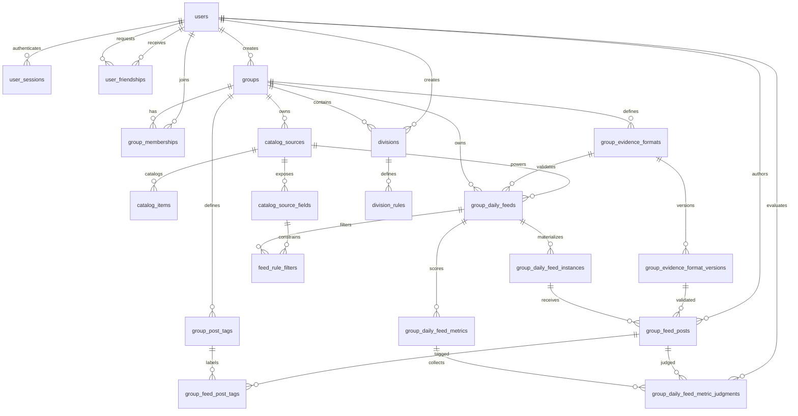

# Data Model

Arcade uses Postgres as the source of truth. The canonical schema lives in
`internal/migrations/*.sql`; the Go structs in `internal/app/types.go` describe
the JSON shape exposed by the API.

## Conventions

- Primary keys are UUIDs generated in Postgres with `gen_random_uuid()` from
  `pgcrypto`.
- Most user-facing mutable tables carry `created_at` and `updated_at`
  timestamps. Tables with `updated_at` use the shared `set_updated_at()` trigger.
- Enum-like values are stored as `text` with `check` constraints instead of
  Postgres enum types.
- Deletion behavior is encoded with foreign-key actions. Ownership-style child
  rows usually cascade.
- Some uniqueness rules use partial indexes to model optional scope, especially
  rows where `source_id` can be null for daily-thread feeds.

## Relationship Map

## Identity

`users` stores local account credentials, profile data, and a shareable friend
code. Email is normalized before storage and enforced uniquely by
`lower(email)`. Passwords are stored as hashes only; plaintext passwords are
never persisted. `username` remains for compatibility and display URLs, but
login uses email. `friend_code` is stored normalized without separators, is
unique, and can be rotated without changing existing friendships or group
memberships.

`user_sessions` stores cookie-backed sessions. Only a SHA-256 hash of the raw
session token is stored; the browser receives the raw token in the
`arcade_session` cookie. Sessions track expiration, optional remember-me
lifetime, revocation, and last-seen metadata.

`user_friendships` stores one durable row per unordered pair of users. The
`user_low_id` and `user_high_id` columns enforce pair uniqueness, while
`requester_user_id` and `addressee_user_id` preserve the direction of the
latest pending request. Friendship status is constrained to `pending`,
`accepted`, `declined`, or `canceled`. Accepted friendships authorize social
actions such as group invites; they do not grant group permissions by
themselves.

## Group Catalog And Daily Feeds

`catalog_sources` stores source collections used by the daily feed system. A
source has a stable `slug`, a `scope`, a name, and a string template. Group
sources use `scope = 'group'` and belong to one group. Global sources use
`scope = 'global'`, have no group owner, and are available to every group for
feed creation. The template renders feed output from keys in the item's `data`
object. If the rendered output starts with `https://`, the frontend presents it
as a link; otherwise it presents the rendered text as a prompt.

`catalog_items` stores rows for a source. Imported rows use `external_id` as a
stable source-local key so repeated bulk imports can upsert the same item. Rows
also have a source-specific `data` JSON object; display labels belong in `data`
with keys such as `name`. Catalog items must not store statements, prompts,
samples, editorials, or solutions.

`catalog_source_fields` stores source-owned metadata for fields that feed rules
may filter on. Presence in this table makes a JSON key filterable. Each field
has a label, value type (`string` or `number`), cardinality flag, and display
order; operator semantics stay in application code.

`group_daily_feeds` stores the durable daily feed definition owned by a group.
Each feed has a unique slug within its group, a kind, an enabled flag, an
assigned evidence format for future posts, explicit schedule columns
(`schedule_starts_at`, `schedule_timezone`, and `schedule_interval_seconds`),
and optional practice-feed source/count columns.
The schedule start date cannot be later than the current date in the schedule
timezone.
The `catalog_daily` kind selects items from exactly one available
`catalog_sources` row. A source is available when it either belongs to the feed
group or has global scope.
The `daily_thread` kind is a general group daily surface with no source, item
count, or catalog filters. A partial unique index allows only one
`daily_thread` feed per group, while deletion frees the group to create another
one later.

`feed_rule_filters` stores practice feed filters relationally. Each filter
references a feed, the feed source, and one `catalog_source_fields` row, then
stores an operator plus either text operands or numeric operands. Scalar values
are represented as one-element arrays; multi-value operators use the same
columns with multiple operands.

Catalog daily feed outputs are generated on demand from `group_daily_feeds`,
`catalog_items`, `catalog_sources`, `catalog_source_fields`, and
`feed_rule_filters`. Daily thread outputs return the daily feed shell without
generated items. Generated outputs are not persisted.

`group_daily_feed_generations` stores explicit reroll state for catalog feed
dates that have been refreshed by a group owner or admin. No row exists for the
default deterministic generation. A refresh creates or updates one `(feed_id,
feed_date)` row with a generation number, seed, refresher, and timestamp; that
seed participates in item selection for that feed/date only. Refreshes are not
allowed once non-deleted posts exist for the feed/date.

`group_daily_feed_instances` materializes a dated `(feed_id, feed_date)` only
when durable member content exists for that feed instance. The row carries
`group_id` for group-scoped lookup and authorization, with composite foreign
keys keeping it consistent with `group_daily_feeds`.

`group_evidence_formats` stores group-owned reusable post evidence format names.
Each format has a stable group-local slug, display name, optional description,
archive timestamp, and creator/updater audit fields. Format names and slugs are
unique within a group. Archiving hides a format from new feed assignments and
post creation while preserving historical post references. Every group has a
`plain-text` format.

`group_evidence_format_versions` stores immutable validation constraints for an
evidence format. The latest `version_number` is the active version used by new
posts for feeds assigned to that format. Constraints are relational columns for
full-body character limits, line count rules, per-line character limits, and
blank-line allowance. Updating constraints inserts a new version instead of
rewriting existing rows.

`group_feed_posts` stores one member-authored response per feed instance. A post
stores normalized text evidence and the exact
`group_evidence_format_versions` row that validated that evidence. `caption` is
optional and separate from evidence. Posts are soft deleted with `deleted_at`,
and the unique `(feed_instance_id, author_user_id)` rule means a later post by
the same member reuses and reactivates the existing row with the feed's current
active evidence format version.

`group_post_tags` stores the post tag vocabulary owned by a group. Arcade does
not create default tag definitions; a group has no tags until an owner or admin
creates them. Tag names are unique case-insensitively within the group across
active and archived tags. API responses order tags by name for user-facing
display. Tags are archived instead of deleted for user-facing removal.

`group_feed_post_tags` attaches group post tags to feed posts. Composite foreign
keys require the post and tag to belong to the same group, and deleting a post
row cascades its attachments. Deleting a tag definition is restricted while
historical posts reference it, so archived tags remain visible on posts through
the join table. Active tags can be attached to existing posts by the post author
or by a group owner/admin. Tag color and pill styling are frontend-controlled;
no per-tag color is stored.

## Feed Metrics And Leaderboards

`group_daily_feed_metrics` stores score definitions owned by a single daily
feed. A metric either names a curated system computation such as `post_count`,
`missed_days`, or `current_streak`, or uses `system_key = 'judged'` with a
plain-language `judgment_prompt`. The table stores display name, aggregation,
creator audit metadata, and a denormalized `group_id` permission boundary.
Built-in system metric values are computed on demand and are not stored.

`group_daily_feed_metric_judgments` stores human judgments for judged metrics.
Each row connects one metric, one group feed post, the judged post author as
`subject_user_id`, and the evaluator. The application copies the subject from
`group_feed_posts.author_user_id`; clients cannot choose it. One evaluator can
keep one judgment per metric/post pair, and later writes replace that evaluator's
value and note.

Leaderboards are computed views over active group members across the feed's
lifetime, from the feed creation date through the current date in the feed
schedule timezone. System metrics read feed posts, feed instances, and feed
schedules. Schedule-based metrics such as `missed_days` and `current_streak`
generate expected feed dates from `group_daily_feeds.schedule_starts_at`,
`schedule_timezone`, and `schedule_interval_seconds`; they do not infer expected
dates from `group_daily_feed_instances`, because instances are only created
after durable member content exists. `current_streak` only credits posts created
while that feed date's scheduled output was the latest output; retroactive posts
to older outputs do not extend the streak.

## Groups And Divisions

`groups` represents a social or team scope. Group slugs are globally unique.
Visibility defaults to `public` and is constrained to `public` or `private`.
Invites are represented by membership rows with `status = 'invited'`; invite
state is not a group visibility mode. Group visibility is the only
public/private content setting: when a group is public, its enabled feeds and
non-deleted posts are public; when a group is private, public group, feed, and
post routes return 404.

`group_memberships` connects users to groups with a role and lifecycle status.
Roles are `owner`, `admin`, or `member`; statuses are `invited`, `active`,
`removed`, or `left`. A user has at most one membership row per group. Social
group invites reuse `status = 'invited'` and record `invited_by_user_id` plus
`invited_at`; the friendship requirement is between that inviter and the
invitee, not between the invitee and every group member.

`divisions` partitions a group or defines a global division when `group_id` is
null. Slugs are unique within a group via `(group_id, slug)`, and global
division slugs are unique through a partial index on rows where `group_id` is
null.

`division_rules` stores optional user-rating criteria for a division.

## Removed Provider Catalog

Migration `009_drop_provider_problem_catalog.sql` removes the old
provider-backed problem catalog (`problem_sources`, `problems`, and
`problem_tags`) plus the legacy flows that depended on it: external accounts,
preferences, daily sets, submissions, and submission-based leaderboards. Current
practice generation is based on group-owned catalog sources and items.
