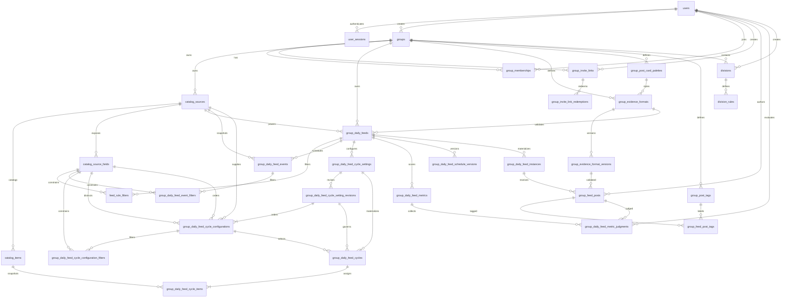

# Data Model

Arcade uses Postgres as the source of truth. The canonical schema lives in
`internal/migrations/*.sql`; the Go structs in `internal/app/types.go` describe
the JSON shape exposed by the API.

## Conventions

- Primary keys are UUIDs generated in Postgres with `gen_random_uuid()` from
  `pgcrypto`.
- Most user-facing mutable tables carry `created_at` and `updated_at`
  timestamps. Tables with `updated_at` use the shared `set_updated_at()` trigger.
- Enum-like values are stored as `text` with `check` constraints instead of
  Postgres enum types.
- Deletion behavior is encoded with foreign-key actions. Ownership-style child
  rows usually cascade.
- Some uniqueness rules use partial indexes to model optional scope, especially
  rows where `source_id` can be null for daily-thread feeds.

## Relationship Map

## Identity

`users` stores local account credentials and profile data. Email is normalized
before storage and enforced uniquely by `lower(email)`. Passwords are stored as
hashes only; plaintext passwords are never persisted. `username` remains for
compatibility and display URLs, but login uses email. The private user record
also stores `theme_preference` as `system`, `dark`, or `light`; this viewer-owned
setting is not part of a group palette and is not exposed through `PublicUser`.

`user_sessions` stores cookie-backed sessions. Only a SHA-256 hash of the raw
session token is stored; the browser receives the raw token in the
`arcade_session` cookie. Sessions track expiration, optional remember-me
lifetime, revocation, and last-seen metadata.

## Group Catalog And Daily Feeds

`catalog_sources` stores source collections used by the daily feed system. A
source has a stable `slug`, a `scope`, a name, and a string template. Group
sources use `scope = 'group'` and belong to one group. Global sources use
`scope = 'global'`, have no group owner, and are available to every group for
feed creation. The template renders feed output from keys in the item's `data`
object. If the rendered output starts with `https://`, the frontend presents it
as a link; otherwise it presents the rendered text as a prompt.

`catalog_items` stores rows for a source. Imported rows use `external_id` as a
stable source-local key so repeated bulk imports can upsert the same item. Rows
also have a source-specific `data` JSON object; display labels belong in `data`
with keys such as `name`. Catalog items must not store statements, prompts,
samples, editorials, or solutions.

`catalog_source_fields` stores source-owned metadata for fields that feed rules
may filter on. Presence in this table makes a JSON key filterable. Each field
has a label, value type (`string` or `number`), cardinality flag, and display
order; operator semantics stay in application code.

`group_daily_feeds` stores the durable daily feed definition owned by a group.
Each feed has a unique slug within its group, a kind, an enabled flag, an
assigned evidence format for future posts, a `captions_enabled` flag that
defaults to true, explicit schedule columns
(`schedule_starts_at`, `schedule_timezone`, and `schedule_interval_seconds`),
and optional practice-feed source/count columns.
The schedule start date cannot be later than the current date in the schedule
timezone.
The `catalog_daily` kind selects items from exactly one available
`catalog_sources` row. A source is available when it either belongs to the feed
group or has global scope.
The `daily_thread` kind is a general group daily surface with no source, item
count, or catalog filters. A partial unique index allows only one
`daily_thread` feed per group, while deletion frees the group to create another
one later.

`group_daily_feed_schedule_versions` stores cadence history for each feed. The
current schedule remains denormalized on `group_daily_feeds`, while every
schedule change inserts a version row whose `starts_at` is the moment of the
change. Historical feed output lookups resolve the schedule version active for
the requested date, so old generated dates remain addressable after cadence
changes. Schedule-based metrics use the feed's current schedule, so changing
cadence resets those metric windows.

`feed_rule_filters` stores practice feed filters relationally. Each filter
references a feed, the feed source, and one `catalog_source_fields` row, then
stores an operator plus either text operands or numeric operands. Scalar values
are represented as one-element arrays; multi-value operators use the same
columns with multiple operands.

`group_daily_feed_events` stores bounded configuration overlays for
`catalog_daily` feeds. Each event has a name, optional description, source,
item count, stable selection seed, creator/updater audit metadata, and a date
window. The API exposes inclusive `starts_on` and `ends_on` feed-local calendar
dates. Persistence represents the same window as the half-open range
`[starts_on, ends_before)`, where `ends_before` is the day after the inclusive
end. Event dates apply to the canonical `feed_date` returned by schedule
resolution; they are not UTC instants. A GiST exclusion constraint prevents
overlapping ranges for one feed, while events may occupy consecutive,
non-overlapping dates.

An event row and its `group_daily_feed_event_filters` children are a complete
snapshot of the catalog selection configuration. The child rows preserve the
source field, normalized operator and position, and text or numeric operands
needed to evaluate each typed rule. Editing the permanent feed or its
`feed_rule_filters` therefore does not rewrite an event. The snapshot does not
copy `catalog_items` or source template contents; outputs remain computed
against the current catalog and are not exact historical materializations.

Only upcoming events are freely mutable or deletable. Once the event's first
feed date is current, its name, start date, configuration, and selection seed
freeze. An active event may move its inclusive end earlier or later while
keeping the current feed date covered. Ended events remain read-only. Creating
or moving an event cannot reinterpret a date that already has a
`group_daily_feed_generations` row or non-deleted feed post.
Event writes, rerolls, and post creation lock their parent feed row before
checking or establishing that durable state, closing the race between the
used-date check and the corresponding write.

`group_daily_feed_cycle_settings` stores one bounded Cycle run for a
`catalog_daily` feed. Its `starts_on` date is the first Cycle-managed scheduled
output, and its optional half-open `ends_before` boundary records the end of the
run. Required `schedule_starts_at`, `schedule_timezone`, and
`schedule_interval_seconds` columns snapshot the feed cadence at creation;
Cycle boundaries and lifecycle dates continue using that snapshot after the
feed itself changes. A feed may retain multiple non-overlapping historical
rows, while a partial unique index permits only one row without `ends_before`.
The application requires a daily-or-slower feed cadence and a current-or-later
`starts_on` that aligns with the feed schedule. A historical event whose
inclusive end is before the first-ever Cycle boundary remains valid. Event
writes can never reach that boundary or any later date, even after a run ends,
and new Cycle settings cannot begin until every pre-Cycle event has ended.
Deleting a scheduled run removes its row; ending an active run sets its next
Cycle boundary as `ends_before` and preserves its materialized history. Once
that boundary arrives, a later write may create a new settings row with a civil
`starts_on` on or after the prior `ends_before` and a new schedule snapshot; it
does not reuse the ended run.

`group_daily_feed_cycle_setting_revisions` is the immutable history of Cycle
settings. Each row stores the first Cycle boundary at which it applies, an
`output_count` from 1 through 50, and the deterministic selection seed. The
initial revision starts at the settings boundary. A later settings write adds a
revision effective at the next Cycle boundary instead of altering the active or
a past Cycle. Configuration rotation restarts at revision-local Cycle number
zero when that boundary arrives.

`group_daily_feed_cycle_configurations` stores the ordered Configurations for a
revision. A Configuration has a revision-local stable key, display name and
optional description, its feed source, an optional scalar distinct field, and
either seeded-shuffle or ascending/descending scalar-field delivery order.
Revision-local positions determine the repeating Configuration rotation.
`group_daily_feed_cycle_configuration_filters` stores the Configuration's
ordered, typed filter snapshot with the same relational operands used by feed
and event filters. A missing or non-scalar distinct value makes an item
ineligible for that Configuration. A missing or non-scalar order value remains
eligible and sorts after valid scalars, so delivery order does not change
membership.

`group_daily_feed_cycles` materializes one complete Cycle. It records the
settings revision and Configuration that governed selection, the zero-based
settings-wide and revision-local Cycle numbers, half-open feed-date boundary,
deterministic seed, and generation. Unique `(settings_id, cycle_number)`,
`(revision_id, revision_cycle_number)`, and `(feed_id, starts_on)` rules prevent
two stored interpretations of one Cycle. Refresh changes the complete Cycle in
one transaction, increments `generation`, and records the responsible user and
time.

`group_daily_feed_cycle_items` freezes exactly one selected item for every
scheduled output in a materialized Cycle. Position and `feed_date` are unique
within the Cycle, and the same catalog item cannot appear twice. Each row
retains the catalog item identity plus its source name, title, data object, and
rendered action snapshot, so later catalog edits cannot reinterpret an assigned
output. A preview computes the same complete ordered selection without inserting
Cycle or item rows. Normal reads materialize complete current or past Cycles,
while upcoming Cycles remain preview-only.

Catalog daily feed outputs are generated on demand from `group_daily_feeds`,
`catalog_items`, `catalog_sources`, `catalog_source_fields`, and
`feed_rule_filters`, or from the applicable event snapshot in place of the
permanent catalog configuration. On a cycle-managed date, output reads use the
frozen `group_daily_feed_cycle_items` assignment instead. Daily thread outputs
do not support events or Cycles and return the daily feed shell without
generated items. Non-cycle generated outputs are not persisted.

`group_daily_feed_generations` stores explicit reroll state for catalog feed
dates that have been refreshed by a group owner or admin. No row exists for the
default deterministic generation. A refresh creates or updates one `(feed_id,
feed_date)` row with a generation number, seed, refresher, and timestamp; that
seed participates in item selection for that feed/date only. For an event date,
the deterministic selection input includes both the stable event seed and the
per-date reroll seed; the reroll row remains independent of the event and does
not replace its snapshot. Refreshes are not allowed once non-deleted posts exist
for the feed/date. Cycle refresh state is stored on `group_daily_feed_cycles`
instead: refresh replaces every item in the current Cycle and is rejected once
any date in that Cycle has a non-deleted post.

`group_daily_feed_instances` materializes a dated `(feed_id, feed_date)` only
when durable member content exists for that feed instance. The row carries
`group_id` for group-scoped lookup and authorization, with composite foreign
keys keeping it consistent with `group_daily_feeds`.

`group_evidence_formats` stores group-owned reusable post evidence format names.
Each format has a stable group-local slug, display name, optional description,
archive timestamp, mutable display appearance, and creator/updater audit fields.
The appearance consists of `content_typeface` (`monospace` or `serif`) and a
group-owned `content_card_palette_id`. Format names and slugs are unique within a
group. Archiving hides a format from new feed assignments and post creation
while preserving historical post references. Every group has a `plain-text`
format, initially using the monospace typeface and its Chalkboard palette.

`group_post_card_palettes` stores reusable, group-owned card color intent. Each
palette uses the versioned `arcade-pigment-v1` material model: a surface hue in
`0..359`, surface colorfulness in `0..100`, and an optional accent hue and
colorfulness pair with the same ranges. Concrete dim, bright, border, and
spotlight colors are derived by the frontend for the active viewer theme; they
are not persisted as fixed display colors. Each group has one locked
`chalkboard` system palette, seeded with surface `167/95` and accent `173/74`.
Custom palettes carry an optimistic-concurrency `revision` and are soft
archived. An active evidence format prevents its palette from being archived;
archived formats and historical posts retain and hydrate their archived palette.

Appearance is deliberately mutable metadata, not an evidence-format constraint.
Changing a format's typeface or palette does not insert a
`group_evidence_format_versions` row. Because posts retain the format through
their immutable constraint version, current palette edits restyle both current
and historical posts that use that format.

`group_evidence_format_versions` stores immutable validation constraints for an
evidence format. The latest `version_number` is the active version used by new
posts for feeds assigned to that format. Constraints are relational columns for
full-body character limits, line count rules, per-line character limits, and
blank-line allowance. Updating constraints inserts a new version instead of
rewriting existing rows.

`group_feed_posts` stores one member-authored response per feed instance. A post
stores normalized text evidence and the exact
`group_evidence_format_versions` row that validated that evidence. `caption` is
optional and separate from evidence. A feed with captions disabled rejects new
non-null caption values but retains and continues to expose historical captions;
omitting a caption during an evidence edit leaves the existing value unchanged.
Posts are soft deleted with `deleted_at`, and the unique
`(feed_instance_id, author_user_id)` rule means a later post by the same member
reuses and reactivates the existing row with the feed's current active evidence
format version.

`group_post_tags` stores the post tag vocabulary owned by a group. Arcade does
not create default tag definitions; a group has no tags until an owner or admin
creates them. Tag names are unique case-insensitively within the group across
active and archived tags. API responses order tags by name for user-facing
display. Tags are archived instead of deleted for user-facing removal.

`group_feed_post_tags` attaches group post tags to feed posts. Composite foreign
keys require the post and tag to belong to the same group, and deleting a post
row cascades its attachments. Deleting a tag definition is restricted while
historical posts reference it, so archived tags remain visible on posts through
the join table. Active tags can be attached to existing posts by the post author
or by a group owner/admin. Tag color and pill styling are frontend-controlled;
no per-tag color is stored.

## Feed Metrics And Leaderboards

`group_daily_feed_metrics` stores score definitions owned by a single daily
feed. A metric either names a curated system computation such as `post_count`,
`missed_days`, or `current_streak`, or uses `system_key = 'judged'` with a
plain-language `judgment_prompt`. The table stores display name, aggregation,
creator audit metadata, and a denormalized `group_id` permission boundary.
Built-in system metric values are computed on demand and are not stored.

`group_daily_feed_metric_judgments` stores human judgments for judged metrics.
Each row connects one metric, one group feed post, the judged post author as
`subject_user_id`, and the evaluator. The application copies the subject from
`group_feed_posts.author_user_id`; clients cannot choose it. One evaluator can
keep one judgment per metric/post pair, and later writes replace that evaluator's
value and note.

Leaderboards are computed views over active group members across the feed's
lifetime, from the feed creation date through the current date in the feed
schedule timezone. System metrics read feed posts, feed instances, and feed
schedules. Schedule-based metrics such as `missed_days` and `current_streak`
generate expected feed dates from `group_daily_feeds.schedule_starts_at`,
`schedule_timezone`, and `schedule_interval_seconds`; they do not infer expected
dates from `group_daily_feed_instances`, because instances are only created
after durable member content exists. Schedule-based metrics ignore scheduled
output windows that ended before an active member's `joined_at`; the window
containing the join remains eligible. `current_streak` only credits posts
created while that feed date's scheduled output was the latest output;
retroactive posts to older outputs do not extend the streak.

## Groups And Divisions

`groups` represents a social or team scope. Group slugs are globally unique.
Visibility defaults to `public` and is constrained to `public` or `private`.
Joining defaults to `invite_only` and is constrained to `invite_only` or `open`;
only public groups may use open joining. Invite links and joining policy are
separate from visibility. When a group is public, its enabled feeds and
non-deleted posts are public; when a group is private, public group, feed, and
post routes return 404.

`group_memberships` connects users to groups with a role and lifecycle status.
Roles are `owner`, `admin`, or `member`; statuses are `active`, `removed`, or
`left`. A user has at most one membership row per group. Invite-link joins and
authenticated self-joins into public open groups activate a membership directly.
Invite-link joins record `invited_by_user_id`, `invited_at`, and `invite_link_id`
for accountability. A removed membership remains as a durable tombstone and
cannot self-join an open group.

`group_invite_links` stores owner/admin-created admission links for a group.
Only a SHA-256 hash of the raw token is stored. Each link records its creator,
optional label, expiration, optional max-use limit, revocation timestamp, and
created/updated timestamps. A link is redeemable only while unrevoked,
unexpired, under its use limit, and created by a user who is still an active
member of the group.

`group_invite_link_redemptions` stores durable audit rows for successful link
redemptions. Each redemption records the group, link, joining user, link creator
copied as `invited_by_user_id`, and redemption time. Redemptions survive link
creator deletion by setting the creator reference to null.

`divisions` partitions a group or defines a global division when `group_id` is
null. Slugs are unique within a group via `(group_id, slug)`, and global
division slugs are unique through a partial index on rows where `group_id` is
null.

`division_rules` stores optional user-rating criteria for a division.

## Removed Provider Catalog

Migration `009_drop_provider_problem_catalog.sql` removes the old
provider-backed problem catalog (`problem_sources`, `problems`, and
`problem_tags`) plus the legacy flows that depended on it: external accounts,
preferences, daily sets, submissions, and submission-based leaderboards. Current
practice generation is based on group-owned catalog sources and items.
