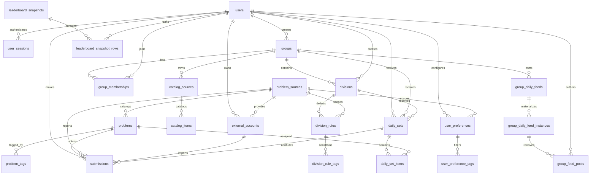

# Data Model

Arcade uses Postgres as the source of truth. The canonical schema lives in
`internal/migrations/*.sql`; the Go structs in `internal/app/types.go` describe
the JSON shape exposed by the API.

## Conventions

- Primary keys are UUIDs generated in Postgres with `gen_random_uuid()` from
  `pgcrypto`.
- Most user-facing mutable tables carry `created_at` and `updated_at`
  timestamps. Tables with `updated_at` use the shared `set_updated_at()` trigger.
- Enum-like values are stored as `text` with `check` constraints instead of
  Postgres enum types.
- Deletion behavior is encoded with foreign-key actions. Ownership-style child
  rows usually cascade; historical records such as submissions generally keep
  their problem and source references.
- Some uniqueness rules use partial indexes to model optional scope, especially
  rows where `source_id` or `scope_id` can be null.

## Relationship Map

## Identity And Providers

`users` stores local account credentials and profile data. Email is normalized
before storage and enforced uniquely by `lower(email)`. Passwords are stored as
hashes only; plaintext passwords are never persisted. `username` remains for
compatibility and display URLs, but login uses email.

`user_sessions` stores cookie-backed sessions. Only a SHA-256 hash of the raw
session token is stored; the browser receives the raw token in the
`arcade_session` cookie. Sessions track expiration, optional remember-me
lifetime, revocation, and last-seen metadata.

`problem_sources` stores external problem providers such as Codeforces, AtCoder,
and Advent of Code. Each source has a stable `slug`, display name, base URL, and
capability flags for submissions, ratings, and tags.

`external_accounts` links a local user to a handle on a problem source. The
same `(source_id, external_handle)` can only be linked once. Sync state is
tracked with `sync_status`, `verified_at`, and `last_synced_at`.

## Catalog

`problems` stores provider problems. The provider identity is
`(source_id, external_id)`, which is unique. Optional contest metadata, rating,
difficulty label, and publish timestamp support source-specific catalog views.

`problem_tags` stores tags for a problem. Tags have a `source` value of
`provider`, `arcade`, `user`, or `model`, with one row per
`(problem_id, tag, source)`.

The initial migration seeds source rows and a small Codeforces problem catalog
with provider tags. Seed rows use `on conflict` so a fresh database can be
created from migrations alone.

## Group Catalog And Daily Feeds

`catalog_sources` stores group-owned source collections used by the daily feed
system. A source has a group, name, and string template. The template renders
feed output from an item title plus keys in the item's `data` object. If the
rendered output starts with `https://`, the frontend presents it as a link;
otherwise it presents the rendered text as a prompt.

`catalog_items` stores user-managed rows for a source. Rows have a display
`title` and source-specific `data` JSON. The model intentionally does not ask
users for external IDs, item kinds, or separate locator fields. For Codeforces,
`data` contains keys such as `contest_id`, `index`, `rating`, and `tags`.
Catalog items must not store statements, prompts, samples, editorials, or
solutions.

`group_daily_feeds` stores the durable daily feed definition owned by a group.
Each feed has a unique slug within its group, a kind, an enabled flag, audience
JSON, schedule JSON, and rule JSON. The `catalog_daily` kind uses `blocks` that
select catalog items by `source_id`, count, `data.rating`, and `data.tags`.
The `daily_thread` kind is a general group daily surface with no prompt or
catalog rules. A partial unique index allows only one `daily_thread` feed per
group, while deletion frees the group to create another one later.

Catalog daily feed outputs are generated on demand from `group_daily_feeds`,
`catalog_items`, and `catalog_sources`. Daily thread outputs return the daily
feed shell without generated items. Generated outputs are not written to
`daily_sets` or item rows.

`group_daily_feed_instances` materializes a dated `(feed_id, feed_date)` only
when durable member content exists for that feed instance. The row carries
`group_id` for group-scoped lookup and authorization, with composite foreign
keys keeping it consistent with `group_daily_feeds`.

`group_feed_posts` stores one member-authored response per feed instance. A post
currently requires plaintext evidence with `evidence_kind = 'text'`; `caption`
is optional and separate from evidence. Posts are soft deleted with
`deleted_at`, and the unique `(feed_instance_id, author_user_id)` rule means a
later post by the same member reuses and reactivates the existing row.

## Preferences

`user_preferences` stores daily recommendation settings. A row can be global
for a user when `source_id` is null, or scoped to a single problem source when
`source_id` is set. Partial unique indexes enforce one global preference row per
user and one source-specific row per `(user_id, source_id)`.

`user_preference_tags` stores tag preferences for a preference row. The
`preference` value is either `preferred` or `blocked`, and each
`(user_preference_id, tag, preference)` is unique.

## Groups And Divisions

`groups` represents a social or team scope. Group slugs are globally unique.
Visibility is constrained to `public`, `invite_only`, or `private`.

`group_memberships` connects users to groups with a role and lifecycle status.
Roles are `owner`, `admin`, or `member`; statuses are `invited`, `active`,
`removed`, or `left`. A user has at most one membership row per group.

`divisions` partitions a group or defines a global division when `group_id` is
null. Slugs are unique within a group via `(group_id, slug)`, and global
division slugs are unique through a partial index on rows where `group_id` is
null.

`division_rules` stores rating, source, and problem-count criteria for a
division. `division_rule_tags` adds required or excluded tag constraints for a
rule.

## Legacy Daily Sets

`daily_sets` is the older header for generated daily assignments. The
`scope_type` can be `user`, `group`, `division`, `group_division`, or `global`.
Scope-specific foreign keys are optional so the row can represent different
scopes, while uniqueness is enforced by `(scope_type, scope_id, date)` plus a
partial unique index for null `scope_id`.

`daily_set_items` stores the ordered problems in an older daily set. Each
problem can appear once per set, and each position can be used once per set.
Item roles are `warmup`, `target`, `stretch`, or `bonus`.

These tables remain in the schema for the legacy daily endpoints, manual solve
attribution, and daily-set leaderboard code. The group daily feed model does not
materialize outputs into these tables.

## Submissions And Solves

`submissions` records imported or manual user attempts. Verdicts include
provider-style results such as `accepted`, `wrong_answer`, and
`time_limit_exceeded`, plus Arcade-specific values such as `completed` and
`manual_solve`.

External submissions are deduplicated by `(source_id, external_submission_id)`.
Because Postgres unique indexes allow multiple null values, manual submissions
without an external submission ID are not blocked by that constraint.

If a daily set is deleted, related submissions keep their solve history and set
`daily_set_id` to null. If a user is deleted, that user's submissions are
deleted.

## Leaderboards

The live leaderboard API is derived from `submissions`. The
`leaderboard_snapshots` and `leaderboard_snapshot_rows` tables exist for future
materialized leaderboards. Snapshot scope is constrained to `global`, `group`,
`daily`, or `division`; periods are `all_time`, `yearly`, `monthly`, `weekly`,
or `daily`; metrics are `points`, `solves`, `rating_gain`, or `streak`.

Rows are unique by rank and user within a snapshot. Snapshot headers also have a
partial unique index for null `scope_id` so global snapshots are unique by
`(scope_type, period, metric, computed_at)`.
