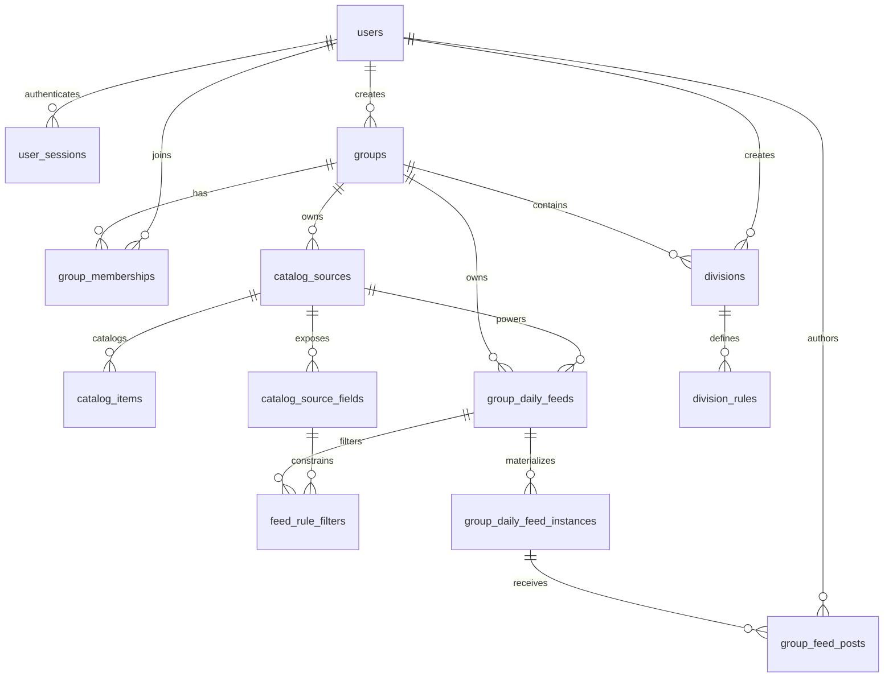

# Data Model

Arcade uses Postgres as the source of truth. The canonical schema lives in
`internal/migrations/*.sql`; the Go structs in `internal/app/types.go` describe
the JSON shape exposed by the API.

## Conventions

- Primary keys are UUIDs generated in Postgres with `gen_random_uuid()` from
  `pgcrypto`.
- Most user-facing mutable tables carry `created_at` and `updated_at`
  timestamps. Tables with `updated_at` use the shared `set_updated_at()` trigger.
- Enum-like values are stored as `text` with `check` constraints instead of
  Postgres enum types.
- Deletion behavior is encoded with foreign-key actions. Ownership-style child
  rows usually cascade.
- Some uniqueness rules use partial indexes to model optional scope, especially
  rows where `source_id` can be null for daily-thread feeds.

## Relationship Map

## Identity

`users` stores local account credentials and profile data. Email is normalized
before storage and enforced uniquely by `lower(email)`. Passwords are stored as
hashes only; plaintext passwords are never persisted. `username` remains for
compatibility and display URLs, but login uses email.

`user_sessions` stores cookie-backed sessions. Only a SHA-256 hash of the raw
session token is stored; the browser receives the raw token in the
`arcade_session` cookie. Sessions track expiration, optional remember-me
lifetime, revocation, and last-seen metadata.

## Group Catalog And Daily Feeds

`catalog_sources` stores source collections used by the daily feed system. A
source has a stable `slug`, a `scope`, a name, and a string template. Group
sources use `scope = 'group'` and belong to one group. Global sources use
`scope = 'global'`, have no group owner, and are available to every group for
feed creation. The template renders feed output from keys in the item's `data`
object. If the rendered output starts with `https://`, the frontend presents it
as a link; otherwise it presents the rendered text as a prompt.

`catalog_items` stores rows for a source. Imported rows use `external_id` as a
stable source-local key so repeated bulk imports can upsert the same item. Rows
also have a source-specific `data` JSON object; display labels belong in `data`
with keys such as `name`. Catalog items must not store statements, prompts,
samples, editorials, or solutions.

`catalog_source_fields` stores source-owned metadata for fields that feed rules
may filter on. Presence in this table makes a JSON key filterable. Each field
has a label, value type (`string` or `number`), cardinality flag, and display
order; operator semantics stay in application code.

`group_daily_feeds` stores the durable daily feed definition owned by a group.
Each feed has a unique slug within its group, a kind, an enabled flag, explicit
schedule columns (`schedule_starts_at`, `schedule_timezone`, and
`schedule_interval_seconds`), and optional practice-feed source/count columns.
The `catalog_daily` kind selects items from exactly one available
`catalog_sources` row. A source is available when it either belongs to the feed
group or has global scope.
The `daily_thread` kind is a general group daily surface with no source, item
count, or catalog filters. A partial unique index allows only one
`daily_thread` feed per group, while deletion frees the group to create another
one later.

`feed_rule_filters` stores practice feed filters relationally. Each filter
references a feed, the feed source, and one `catalog_source_fields` row, then
stores an operator plus either text operands or numeric operands. Scalar values
are represented as one-element arrays; multi-value operators use the same
columns with multiple operands.

Catalog daily feed outputs are generated on demand from `group_daily_feeds`,
`catalog_items`, `catalog_sources`, `catalog_source_fields`, and
`feed_rule_filters`. Daily thread outputs return the daily feed shell without
generated items. Generated outputs are not persisted.

`group_daily_feed_instances` materializes a dated `(feed_id, feed_date)` only
when durable member content exists for that feed instance. The row carries
`group_id` for group-scoped lookup and authorization, with composite foreign
keys keeping it consistent with `group_daily_feeds`.

`group_feed_posts` stores one member-authored response per feed instance. A post
currently requires plaintext evidence with `evidence_kind = 'text'`; `caption`
is optional and separate from evidence. Posts are soft deleted with
`deleted_at`, and the unique `(feed_instance_id, author_user_id)` rule means a
later post by the same member reuses and reactivates the existing row.

## Groups And Divisions

`groups` represents a social or team scope. Group slugs are globally unique.
Visibility is constrained to `public`, `invite_only`, or `private`.

`group_memberships` connects users to groups with a role and lifecycle status.
Roles are `owner`, `admin`, or `member`; statuses are `invited`, `active`,
`removed`, or `left`. A user has at most one membership row per group.

`divisions` partitions a group or defines a global division when `group_id` is
null. Slugs are unique within a group via `(group_id, slug)`, and global
division slugs are unique through a partial index on rows where `group_id` is
null.

`division_rules` stores optional user-rating criteria for a division.

## Removed Provider Catalog

Migration `009_drop_provider_problem_catalog.sql` removes the old
provider-backed problem catalog (`problem_sources`, `problems`, and
`problem_tags`) plus the legacy flows that depended on it: external accounts,
preferences, daily sets, submissions, and submission-based leaderboards. Current
practice generation is based on group-owned catalog sources and items.
